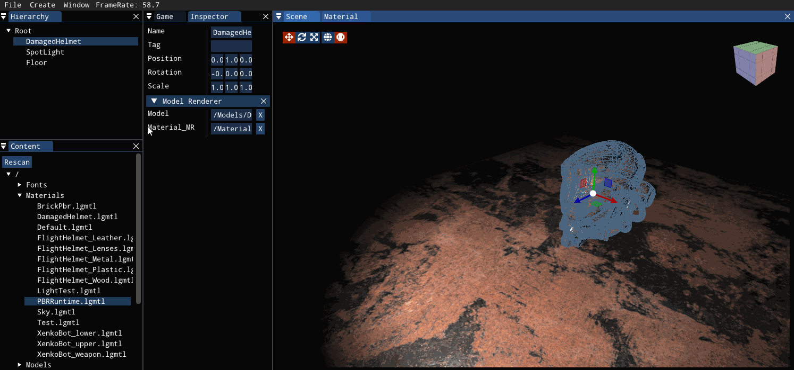

# Loong

I am trying to build a game engine. WIP...

This project is under refactoring... Thus np new feature will not be added before that.

The next version will have a different architecture and a vulkan RHI backend...

----

## Current status.

### scene editing


### material editing


### inspector and light tweaking


### setting material




## How to build

### 0. Requirements

1. A C++ 17 compatible compiler.
2. cmake
3. OpenGL 4.3 compatible GPU on Windows or Linux / OpenGL 4.1 is requried on MacOS

### 1. Get the source code

First, clone this repository with the following command:

```bash
git clone https://github.com/carlcc/Loong.git --recursive
```

Don't forget the `--recursive` option, `glfw` library is added as a git submodule.

If you forgot it, or you just donwload this repository as a zip package, you can execute the following command in the root directory of this repository:

```bash
git submodule update --init --recursive
```

or you can simply download `glfw`'s source code, and unpack it into the `thirdparty` directory.

### 2. Compile

Create a folder named `build`, and in this folder, execute the following command:

```bash
cmake ..
cmake --build .
```

Finally, all the binaries and resources are located in the `out` directory located in the `build` directory.
